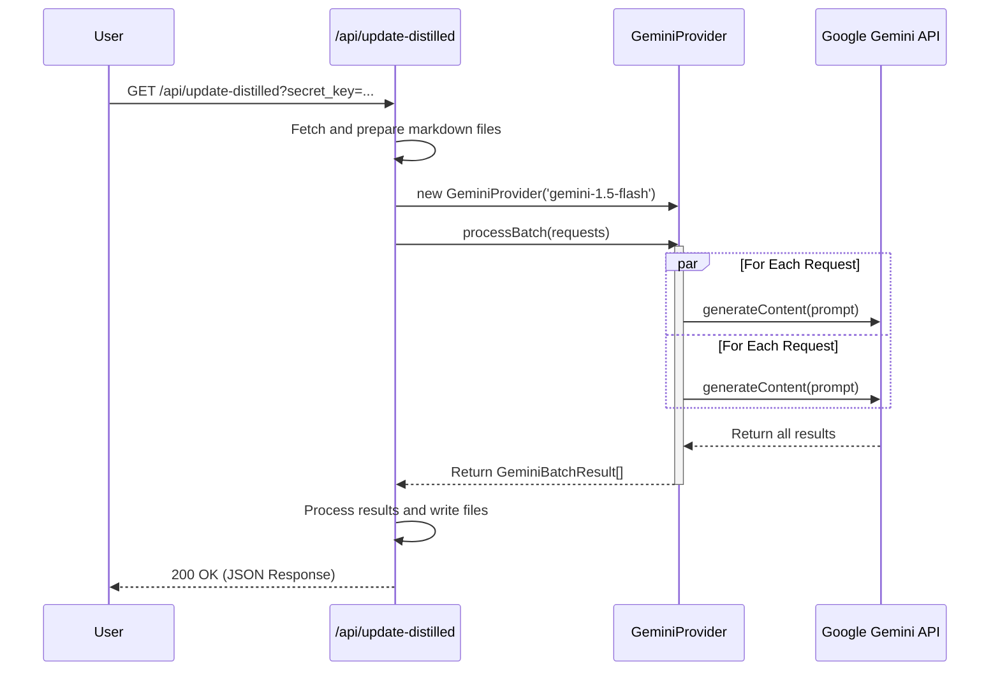

# Plan: Replacing Anthropic with Gemini (v2)

This document provides a detailed technical plan for migrating the LLM provider from Anthropic to Google's Gemini. The goal is to minimize disruption to the existing application logic by adapting the new provider to fit the application's needs.

### 1. Project Setup & Dependencies

1.  **Install Gemini Client Library**: The official Google AI SDK for TypeScript will be added to the project.
    ```bash
    bun add @google/generative-ai
    ```
2.  **Update Environment Variables**: A new environment variable for the Gemini API key will be added.
    *   In `.env.example`, add the line: `GEMINI_API_KEY="your_gemini_api_key"`
    *   The application will expect this key to be present in the server environment.

### 2. `GeminiProvider` Implementation (`src/lib/gemini.ts`)

A new file, `src/lib/gemini.ts`, will be created. It will define the `GeminiProvider` class, which will conform to the `LLMProvider` interface defined in `src/lib/llm.ts`.

**Key Architectural Decision**: The current implementation in `src/routes/api/update-distilled/+server.ts` uses a polling mechanism (`createBatch`, `getBatchStatus`, `getBatchResults`). The Gemini API does not have a job-based batch system. Instead of building a complex stateful emulation layer, we will simplify the process. The `GeminiProvider` will expose a single `processBatch` method that handles concurrent requests and returns the complete set of results once finished. This requires a minor refactoring of the API route but leads to a much simpler and more robust provider.

#### `gemini.ts` Structure:

```typescript
// src/lib/gemini.ts
import type { LLMProvider } from './llm.ts';
import { GoogleGenerativeAI, type GenerativeModel } from '@google/generative-ai';
import { env } from '$env/dynamic/private';

// Interfaces to map Gemini's output to what the app expects
export interface GeminiBatchRequest {
    custom_id: string;
    prompt: string;
}

export interface GeminiBatchResult {
    custom_id: string;
    result: {
        type: 'succeeded' | 'errored';
        response?: string;
        error?: {
            message: string;
        };
    };
}

export class GeminiProvider implements LLMProvider {
    private client: GoogleGenerativeAI;
    private modelId: string;
    name = 'Gemini';
    // ... constructor, getModels, getModelIdentifier, generateResponse ...

    async processBatch(requests: GeminiBatchRequest[]): Promise<GeminiBatchResult[]> {
        // Implementation will use Promise.allSettled to run requests concurrently
    }
}
```

### 3. Refactoring the API Route (`src/routes/api/update-distilled/+server.ts`)

The existing API route will be modified to use the new `GeminiProvider` and its `processBatch` method. The polling logic will be removed.

#### New Control Flow:



#### Code Changes:

The section from line 174 to 197 in `src/routes/api/update-distilled/+server.ts` will be replaced.

**Current Logic:**
```typescript
// Create batch
const batchResponse = await anthropic.createBatch(batchRequests);

// Poll for completion
let batchStatus = await anthropic.getBatchStatus(batchResponse.id);
while (batchStatus.processing_status === 'in_progress') {
    // ... polling logic ...
    batchStatus = await anthropic.getBatchStatus(batchResponse.id);
}

// Get results
const results = await anthropic.getBatchResults(batchStatus.results_url);
```

**New Logic:**
```typescript
// Instantiate the new provider
const gemini = new GeminiProvider('gemini-1.5-flash');

// Prepare requests for the new provider
const batchRequests: GeminiBatchRequest[] = filesToProcess.map(/* ... */);

// Process the batch in a single, concurrent operation
const results = await gemini.processBatch(batchRequests);

// ... continue with processing the results ...
```

### 4. Unit Testing (`src/lib/gemini.test.ts`)

A new test file, `src/lib/gemini.test.ts`, will be created to validate the `GeminiProvider`.

*   **Mocking**: The `@google/generative-ai` module will be mocked using `vi.mock`.
*   **Test Cases**:
    1.  Test that the constructor correctly throws an error if `GEMINI_API_KEY` is missing.
    2.  Test the `generateResponse` method for a single successful prompt.
    3.  Test the `processBatch` method, ensuring it correctly handles a mix of successful and failed API responses from the mocked client.
    4.  Verify that the output of `processBatch` matches the expected `GeminiBatchResult[]` structure.

### 5. Documentation Update

*   The main `README.md` will be updated to mention the new dependency on `@google/generative-ai` and the `GEMINI_API_KEY` environment variable.